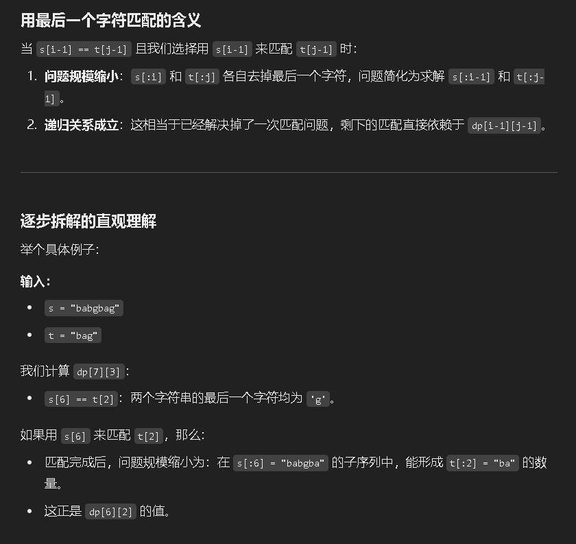

回顾问题的定义
dp[i][j] 表示 在 s[:i] 的所有子序列中，能形成 t[:j] 的数量。
假设当前字符 s[i-1] == t[j-1]：
如果我们用 s[i-1] 和 t[j-1] 来匹配，那么匹配结束后，问题就变成：
在 s[:i-1] 的子序列中，能形成 t[:j-1] 的数量。
这个数量，正是 dp[i-1][j-1]

用最后一个字符匹配的含义
当 s[i-1] == t[j-1] 且我们选择用 s[i-1] 来匹配 t[j-1] 时：
问题规模缩小：s[:i] 和 t[:j] 各自去掉最后一个字符，问题简化为求解 s[:i-1] 和 t[:j-1]。
递归关系成立：这相当于已经解决掉了一次匹配问题，剩下的匹配直接依赖于 dp[i-1][j-1]

逐步拆解的直观理解
举个具体例子：
输入：
s = "babgbag"
t = "bag"
我们计算 dp[7][3]：

s[6] == t[2]：两个字符串的最后一个字符均为 'g'。
如果用 s[6] 来匹配 t[2]，那么：

匹配完成后，问题规模缩小为：在 s[:6] = "babgba" 的子序列中，能形成 t[:2] = "ba" 的数量。
这正是 dp[6][2] 的值。
两个匹配来源总结
如果我们用 s[i-1] 匹配 t[j-1]，问题规模缩小，对应 dp[i-1][j-1]。
如果我们不用 s[i-1] 匹配 t[j-1]，问题规模保持不变，对应 dp[i-1][j]。
最终，dp[i][j] 的值就是两种情况的总和。