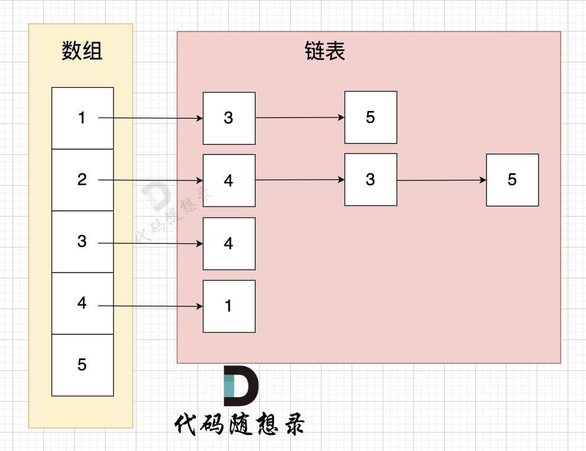

一、图论理论基础
1. 图的种类: 无向图、有向图；加权图
2. 度：五香途中连接该点的边数
3. 出度和入度：从该节点出发的边的个数；指向该节点边的个数
4. 连通性：
   - 连通图：无向图中任何两个节点都是可以到达的； 非连通图：若有节点不能到达其他节点
   - 强连通图：在有向图中，任何两个节点是可以相互到达的 （注意要是相互！）
   - 连通分量：无向图中的极大连通子图称为该图的一个连通分量（注意是极大！任意一个子图是不行的，必须把子图扩展到最大）
   - 强联通分量：邮箱途中极大强连通子图

二、图的代码表示
一般使用邻接表、邻接矩阵 或者用类来表示。
主要是 朴素存储、邻接表和邻接矩阵。
1. 邻接矩阵
    用二维数组来表示图解构， 邻接矩阵是从节点的角度来表示图，有多少节点就申请多大的二维数组。
    例如： grid[2][5] = 6，表示 节点 2 连接 节点5 为有向图，节点2 指向 节点5，边的权值为6。
    如果想表示无向图，即：grid[2][5] = 6，grid[5][2] = 6，表示节点2 与 节点5 相互连通，权值为6。
 - 优点：简单、任意两个顶点之间是否存在边的操作非常快、适合稠密图（边数接近顶点数平方）
 - 缺点：时间空间浪费。不适合稀疏图（点多边少），申请过大二维数组造成空间浪费，且遍历边需要遍历整个数组，时间浪费

2. 邻接表 
    数组+链表的方式，从边的角度来表示图，有多少边申请对应大小链表，有多少边 邻接表才会申请多少个对应的链表节点。
     这里数组存放每个节点，保存每个节点的头指针，指向的链表通常没有顺序，但是要包含该点出发的所有边
 - 优点：只需要存储边空间利用率高，遍历节点连接情况相对容易 
 - 缺点：检查两个点之间是否存在变效率相对较低，需要 O(V)时间，V表示某节点连接其他节点的数量；实现难理解

三、遍历方式：深度优先搜索dfs和广度优先搜索bfs
深度优先搜索（dfs），就不得不说和广度优先搜索（bfs）有什么区别
dfs是可一个方向去搜，不到黄河不回头，直到遇到绝境了，搜不下去了，再换方向（换方向的过程就涉及到了回溯）。
bfs是先把本节点所连接的所有节点遍历一遍，走到下一个节点的时候，再把连接节点的所有节点遍历一遍，搜索方向更像是广度，四面八方的搜索过程。

深搜三部曲：
1. 确认递归函数，参数
void dfs(参数)

2. 确认终止条件
if (终止条件) {
    存放结果;
    return;
}

3. 处理目前搜索节点出发的路径
for (选择：本节点所连接的其他节点) {
    处理节点;
    dfs(图，选择的节点); // 递归
    回溯，撤销处理结果
}

广度优先搜索(bfs)，是以起始点为中心一圈一圈进行搜索，一旦遇到中点，记录之前走过的节点就是一条最短路，适合解决最低按路径问题。
容器：队列 栈 数组 都可以
coding模板：
from collections import deque

# 方向数组，表示四个方向：右、下、左、上
dir = [(0, 1), (1, 0), (-1, 0), (0, -1)]

def bfs(grid, visited, x, y):
    # 创建队列并加入起始节点
    que = deque([(x, y)])  #定义队列并加入起始节点
    visited[x][y] = True  # 立刻标记起始节点为访问过
    
    while que:
        curx, cury = que.popleft()  # 从队列中取出当前节点的坐标
        # 遍历当前节点的四个方向
        for dx, dy in dir: // 开始向当前节点的四个方向左右上下去遍历
            nextx, nexty = curx + dx, cury + dy  # 获取周围节点的坐标
            # 检查是否越界
            if nextx < 0 or nextx >= len(grid) or nexty < 0 or nexty >= len(grid[0]):
                continue
            # 如果没有访问过该节点，则加入队列并标记为已访问
            if not visited[nextx][nexty]:
                que.append((nextx, nexty))
                visited[nextx][nexty] = True
