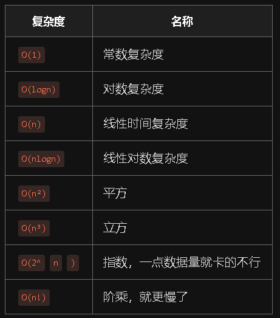
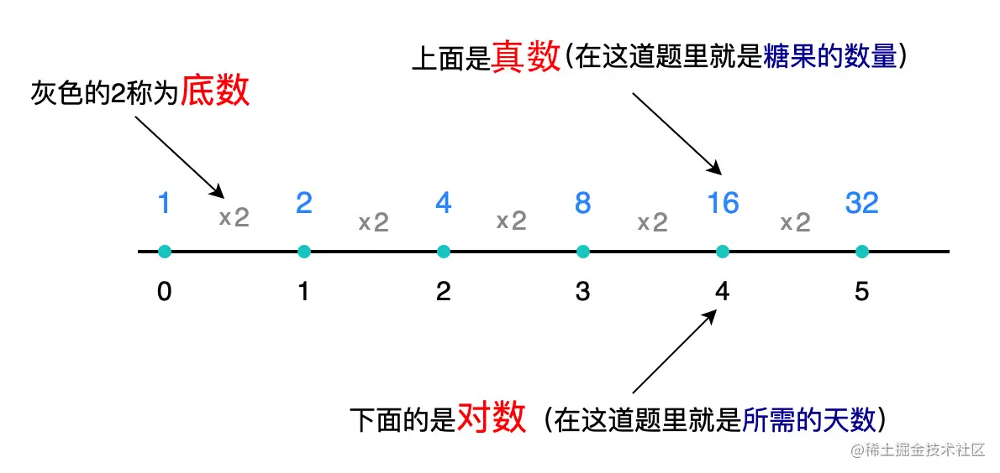

一. 计算时间复杂度
步骤一：执行以下出发点
1. 找到实行次数最多的语句 （如果是三个单层forloop并列在一起，那么随便找一个就行）
2. 语句执行语句的数量级
3. 用O表示结果
步骤二：计算
1. 只保留最高阶项
2. 去掉常数系数

其中比较难算的有O（logn） 举个例子：
这包糖里有16颗，每天吃这一包糖的一半，请问多少天吃完？

意思就是16不断除以2，除几次之后等于1？用代码表示

function foo1(n){
    let day = 0
    while(n > 1){
        n = n/2
        day++
    }
    return day
}
console.log( foo1(16) ) // 4
循环次数的影响主要来源于 n/2 ，这个时间复杂度就是 O(logn) ，这个复杂度是怎么来的呢，别着急，继续看

再比如下面这样

function foo2(n){
    for(let i = 0; i < n; i *= 2){
        console.log("一天")
    }
}
foo2( 16 )

里面的打印执行了 4 次，循环次数主要影响来源于 i *= 2 ，这个时间复杂度也是 O(logn)

这个 O(logn) 是怎么来的，这里补充一个小学三年级数学的知识点，对数，我们看一张图

没有理解的话再看一下，理解一下规律

真数：就是真数，这道题里就是16
底数：就是值变化的规律，比如每次循环都是i*=2，这个乘以2就是规律。比如1,2,3,4,5...这样的值的话，底就是1，每个数变化的规律是+1嘛
对数：在这道题里可以理解成x2乘了多少次，这个次数
仔细观察规律就会发现这道题里底数是 2，而我们要求的天数就是这个对数4，在对数里有一个表达公式

a^b = n  读作以a为底,b的对数=n，在这道题里我们知道a和n的值，也就是  2^b = 16 然后求 b

把这个公式转换一下的写法如下

log(a) n = b    在这道题里就是   log(2) 16 = ?  答案就是 4

公式是固定的，这个16不是固定的，是我们传进去的 n，所以可以理解为这道题就是求 log(2)n = ?

用时间复杂度表示就是 O(log(2)n)，由于时间复杂度需要去掉常数和系数，而log的底数跟系数是一样的，所以也需要去掉，所以最后这个正确的时间复杂度就是 O(logn)